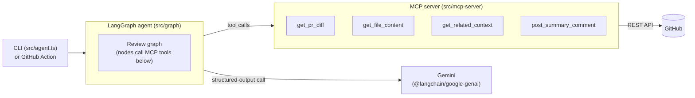
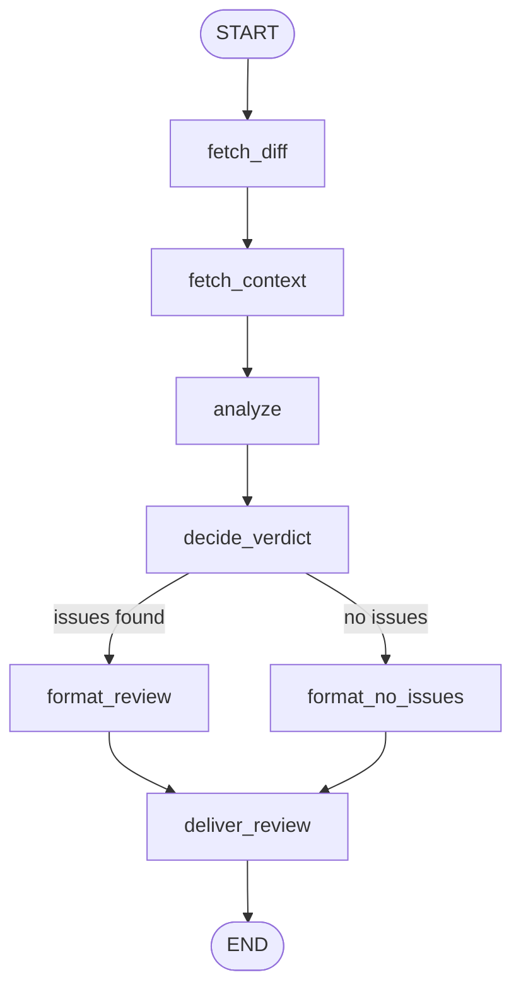

# CodeReviewer

An AI agent that reviews GitHub pull requests: it fetches the diff, builds
real static-analysis context for each changed file (not just the raw
diff text), analyzes each file with an LLM using schema-constrained
structured output, and posts the result as a PR comment — runnable from
the CLI or as a GitHub Action.

Stack: TypeScript, [LangGraph.js](https://langchain-ai.github.io/langgraphjs/),
[MCP](https://modelcontextprotocol.io/) (Model Context Protocol), the
GitHub REST API, Google Gemini (free tier), Zod.

## Problem & motivation

Most "AI code review" demos are a single prompt: dump the diff into an
LLM, print whatever comes back. That falls over quickly on anything
real — large diffs blow the context window, a flaky API call kills the
whole review, and a model with no instruction against it will happily
invent a plausible-sounding issue that isn't there.

This project is a deliberately more disciplined take on the same idea,
built to explore what "production-minded" looks like for an LLM agent
specifically: typed tool boundaries, a real state machine instead of a
prompt chain, retry and partial-failure handling that doesn't just
crash, and — most importantly — verification against real PRs rather
than a happy-path demo. It's a portfolio project for transitioning from
fullstack development into AI agent engineering.

**It works on real code.** A live run against a real PR
([`r671h/MyMessenger#9`](https://github.com/r671h/MyMessenger/pull/9))
correctly found a genuine CORS misconfiguration (any `*.vercel.app`
origin was allowed through with `credentials: true`) and a genuine bug
(a filter that dropped `undefined` values from an origins array was
removed), and correctly routed the verdict to `REQUEST_CHANGES`. That
run is what the architecture below is actually built to support, not a
scenario picked to make the demo look good.

## Architecture





`fetch_context` and `analyze` each iterate the PR's changed files
internally — one `get_related_context` call and one LLM call per file,
not one call for the whole PR. `deliver_review` is an *injected* node:
the graph itself doesn't know whether it's printing to the console
(`print_review`, the default) or posting a real PR comment
(`post_review`, via `--post` or the GitHub Action) — that choice is made
by the caller, not the graph.

## Why this graph design

**Per-file calls, not one call for the whole PR.** The obvious first
approach — paste the entire diff into one prompt — breaks down exactly
where it matters most: a genuinely large PR. Looping per file inside
`fetch_context`/`analyze` means no single LLM call ever sees more than
one file's patch, so prompt size stays bounded regardless of PR size,
and one file's failure doesn't take down the other nine.

**LangGraph's `Send` API (true per-node fan-out) was considered and
deliberately deferred, not overlooked.** `Send` would add real
parallelism between files on top of what the current design already
has (bounded prompts, isolated failures). It wasn't worth gating this
delivery on verifying its typed integration behavior under time
pressure when the internal-loop shape already delivers the correctness
property that actually matters. This is written down as an explicit
open item in [PLAN.md](PLAN.md), not quietly skipped.

**A real conditional edge, not an if-statement dressed up.**
`decide_verdict` maps `issues` to `REQUEST_CHANGES` / `COMMENT` /
`APPROVE` — deliberately the same vocabulary GitHub's own PR review API
uses — and a genuine LangGraph conditional edge routes to `format_review`
or `format_no_issues`. Those are two structurally separate code paths:
`format_no_issues` never touches issue-generation logic at all, so it
*can't* fabricate a finding. That's a stronger guarantee than "the
prompt says not to."

**Every node is a plain, independently testable function.** Nodes are
`(state) => Partial<State>`, or a factory `makeXNode(deps) => (state) =>
...` when they need injected dependencies (an MCP tool function, the LLM
caller, `print`/`postSummaryComment`). Nothing reads from module-level
globals. That's what makes 77 tests possible without a single real
network or LLM call in the suite — every dependency is a fake at the
boundary.

## Key technical decisions

### Why MCP for the GitHub layer

Tool logic lives in `src/mcp-server`, is the *only* way the graph
touches GitHub (enforced by the repo's own conventions, not just
discipline), and is genuinely independent of this specific graph:
`src/mcp-server/index.ts` runs a real, spec-compliant MCP server over
stdio, so the same tools could be wired into Claude Desktop or any other
MCP client tomorrow, unmodified. Each tool also throws a *typed* error
(`GitHubNetworkError` / `GitHubAuthError` / `GitHubRateLimitError` /
`GitHubNotFoundError`, each carrying a `category`), not a generic
`Error` — so a caller can distinguish "the PR doesn't exist" from
"GitHub is down" from "the token is bad" instead of pattern-matching a
message string. `GitHubRateLimitError` specifically exists because
GitHub returns the *same* 403 for a bad/insufficient token and for
rate limiting (primary: `x-ratelimit-remaining: 0`; secondary/abuse
detection: a `retry-after` header and/or "rate limit" in the body) —
conflating the two as one auth error misleads diagnosis
(`src/mcp-server/github/classify-403.ts`).

### Why LangGraph, not a prompt chain

A PR review is a pipeline with a genuine branch point (issues vs. none)
and a genuine partial-failure requirement (one file's LLM call failing
shouldn't sink the whole review) — that's a state machine, not a linear
chain of `.then()`s. LangGraph gives typed state
(`Annotation.Root`, threaded through every node), a real conditional
edge instead of branching logic buried inside one large function, and a
clean seam for testing each node with fakes instead of mocking half a
call stack. Just as importantly, the actual review *logic* has almost no
framework lock-in — nodes are plain functions; LangGraph is doing
orchestration, not owning the business logic.

### Error handling & resilience

- **Typed errors at every GitHub boundary** — network / auth /
  rate_limit / not-found / symbol-not-found, never a bare `Error`.
- **Retry wraps the LLM call specifically**, not everything —
  `withRetry` (`src/graph/retry.ts`): exponential backoff (500ms base,
  ×2 factor), max 3 attempts, because the LLM call is the actually flaky,
  rate-limited part of the pipeline.
- **Skip-and-record, not abort-and-crash.** A file whose analysis
  exhausts its retries doesn't take down the PR review — it's recorded
  in `fileErrors` and surfaced in the final comment ("Could not analyze
  `x.ts`: ...") rather than silently dropped *or* crashing the whole run.
  A failed *post* to GitHub, by contrast, does propagate — a review that
  never reached the PR should look like a failure to whoever's watching
  the CI run, not a silent no-op.
- **Structured output is checked twice.** Gemini's constrained JSON
  generation (`responseJsonSchema`, derived from the same Zod schema)
  constrains generation; a client-side `AnalysisResultSchema.parse()`
  checks it again. If the model ever technically violates its own
  schema, that surfaces as a normal thrown error — retried, then
  recorded — not malformed data flowing downstream.
- **A real bug this caught, not a hypothetical:** Zod's `.positive()`
  compiles to `exclusiveMinimum` in JSON Schema, which Gemini's
  structured-output mode rejects outright with a 400. Found by testing
  against the real API, not assumed; fixed (`.min(1)` instead) and
  regression-tested (`tests/schemas/review.test.ts`) so it can't
  silently reappear.
- **Secrets never reach the LLM in the clear.** `analyze` runs every
  file's patch and related context through a heuristic scanner
  (`src/graph/secrets.ts` — AWS access key IDs, private key blocks,
  long tokens next to `api_key`/`secret`/`token`/`password`) and
  replaces any match with `[REDACTED]` *before* building the prompt.
  A match also raises a deterministic `critical`/`security` issue on
  its own — it doesn't depend on the model noticing the placeholder.
  Because the raw value is never sent, it can't be echoed back into
  an issue's explanation and end up quoted in the public PR comment.

### One-hop, AST-based context — not the whole file, not regex

`get_related_context` parses the changed file with the real TypeScript
compiler API and extracts exactly two things about the function a diff
actually touched: the signatures of same-file functions it calls, and
the signatures of imported symbols it uses (resolved one hop into the
repo, external packages noted by name only) — capped at roughly 2000
tokens. That's meaningfully more useful to the model than the raw diff
alone, without either a full cross-file RAG pipeline or an unbounded
prompt. Verified against real, complex production TypeScript
(`modelcontextprotocol/typescript-sdk`), not a toy fixture — see
[PLAN.md](PLAN.md) for the full design and its explicit v1 scope limits.

## Setup & run

```bash
npm install
cp .env.example .env   # fill in GITHUB_TOKEN and GEMINI_API_KEY
```

- `GITHUB_TOKEN` — a PAT with `contents:read` + `pull-requests:write` on
  the target repo.
- `GEMINI_API_KEY` — free-tier key from
  [aistudio.google.com/apikey](https://aistudio.google.com/apikey).
- `MAX_FILES` (optional, default `30`) — changed files beyond this count
  are skipped (not sent to fetch_context/analyze) rather than analyzed.
- `REVIEW_TIMEOUT_MS` (optional, default `300000` / 5 min) — the whole
  graph run is capped at this; on timeout the process exits with a clear
  error instead of hanging.

```bash
npx tsx src/agent.ts <owner/repo> <pr_number>          # prints the review
npx tsx src/agent.ts <owner/repo> <pr_number> --post   # posts it to the PR
```

### As a GitHub Action in another repo

```yaml
name: AI Code Review
on:
  pull_request:
    types: [opened, synchronize, reopened]
permissions:
  contents: read
  pull-requests: write
jobs:
  review:
    runs-on: ubuntu-latest
    steps:
      - uses: <your-github-username>/CodeReviewer@main
        with:
          repo: ${{ github.repository }}
          pr_number: ${{ github.event.pull_request.number }}
          github_token: ${{ secrets.GITHUB_TOKEN }}
          gemini_api_key: ${{ secrets.GEMINI_API_KEY }}
          # max_files: "30"   # optional, this is the default
```

The built-in `secrets.GITHUB_TOKEN` is enough — no custom PAT needed —
as long as the job grants `pull-requests: write`. See
[action.yml](action.yml) for the action itself (a composite action:
`setup-node` → `npm ci` → `agent.ts --post`, run from the action's own
checkout so it works when consumed by a different repo). This repo also
dogfoods itself: [.github/workflows/review.yml](.github/workflows/review.yml)
reviews CodeReviewer's own PRs with the local copy of the action.

### Tests

```bash
npm test              # 77 tests, vitest, nothing hits a real API
npx tsc --noEmit      # strict type-check, no emit
```

Every node and every MCP tool has an isolated test with the network/LLM
boundary mocked — CLAUDE.md's "no end-to-end test makes a real API call
in CI" rule is enforced by construction, since every `fetch`/LLM call is
behind an injected dependency. Real-world verification happens
separately, deliberately, via manual scripts (`scripts/demo-*.ts`) and
the CLI itself run against real PRs — that's how the exclusiveMinimum
bug above, and a retired Gemini model name, were actually caught.

## What I'd improve next

Concretely, in rough priority order:

1. **True `Send`-based fan-out** for `fetch_context`/`analyze`, so files
   are processed in parallel instead of a sequential loop — the
   deliberately-deferred item from the graph design section above.
2. **Inline, per-line review comments**, not just one summary comment.
   Needs mapping each issue's line number to GitHub's diff `position`
   field for the "create a review" endpoint — nontrivial, and why
   `post_summary_comment` (one comment) shipped first.
3. **Semantic symbol resolution** in the AST context tool instead of
   syntactic name-matching. The current approach can false-positive if a
   locally shadowed variable happens to share a name with an import or a
   sibling function — a known, documented limitation, not a silent gap.
4. **Verify the GitHub Action against a real Actions run.** It's written
   correctly against the GitHub Actions model, but this repo isn't
   pushed to GitHub yet, so nothing about the workflow has actually been
   exercised by a runner — everything else in this README has been
   proven against real API calls; this hasn't, yet.
5. **Exercise an actually large diff** (500+ lines, many files) end to
   end. Per-file bounding and patch truncation are implemented and
   unit-tested, but not proven against a real giant PR.
6. **Multi-hop context resolution.** Capped at one hop by design for v1;
   a function that calls a function that calls a function currently only
   gets context on the first link.
7. **Non-TS/JS language support** for `get_related_context` — other
   file types still get analyzed on diff text alone today, just without
   AST-derived context.

Full design history and every resolved/open question is in
[PLAN.md](PLAN.md), kept up to date across the project rather than
written once and abandoned.
